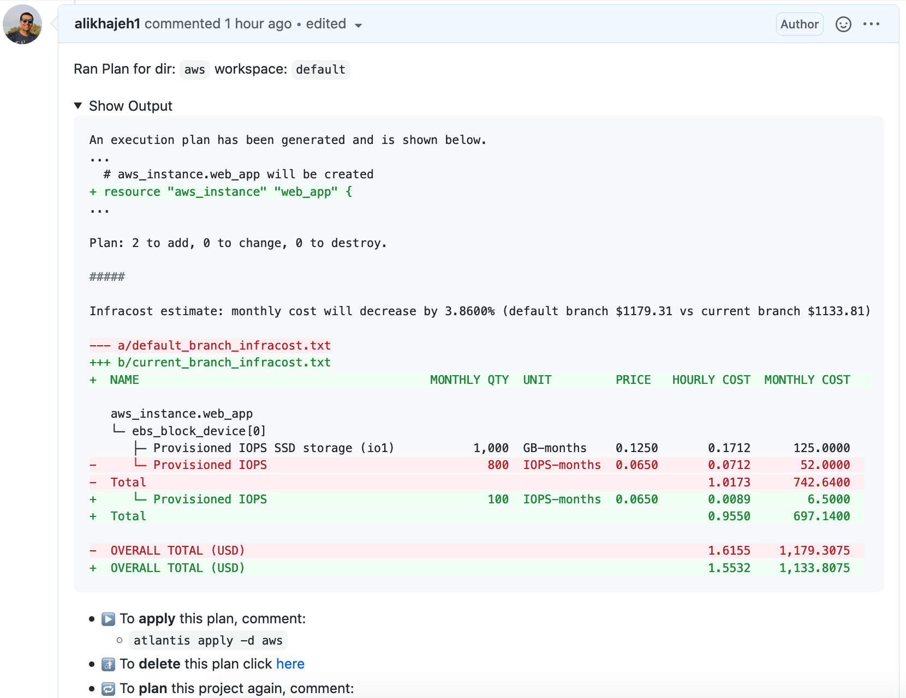

# Infracost Atlantis Integration

This repo shows how [Infracost](https://infracost.io) can be used with Atlantis. It automatically adds a comment to the bottom of Atlantis' output showing the cost estimate difference. See [this pull-request for a demo](https://github.com/infracost/atlantis-demo/pulls#issuecomment-795889174), expand the Show Output sections and scroll down to see the Infracost output.

This integration uses the latest version of Infracost by default as we regularly add support for more cloud resources. If you run into any issues, please join our [community Slack channel](https://www.infracost.io/community-chat); we'd be happy to guide you through it.

As mentioned in our [FAQ](https://www.infracost.io/docs/faq), no cloud credentials or secrets are sent to the Cloud Pricing API. Infracost does not make any changes to your Terraform state or cloud resources.



## Table of Contents

* [Usage methods](#usage-methods)
  * [Docker image](#1-docker-image)
    * [Environment variables](#environment-variables)
  * [Plan JSON API](#2-plan-json-api)
* [Contributing](#contributing)

# Usage methods

There are two methods of integrating Infracost with Atlantis:
1. Use a custom Docker image that [extends](https://www.runatlantis.io/docs/deployment.html#customization) Atlantis' `latest` image to add Infracost. This is the recommended method.

2. Send the `$PLANFILE` from Atlantis to the [Infracost API](https://www.infracost.io/docs/integrations/infracost_api) with `curl`. Whilst this API deletes files from the server after they are processed, it is a good security practice to remove secrets from the file before sending it to the API. For example, AWS provides [a grep command](https://gist.github.com/alikhajeh1/f2c3f607c44dabc70c73e04d47bb1307) that can be used to do this.

## 1. Docker image

This method runs `infracost diff` using the `$PLANFILE` that Atlantis generates. The following steps describe how you can use this method:

1. [This Docker image](https://hub.docker.com/repository/docker/infracost/infracost-atlantis/) extends the Atlantis image by adding the Infracost CLI and the [`infracost_atlantis_diff.sh`](https://github.com/infracost/infracost/blob/master/scripts/ci/atlantis_diff.sh) script. If you already use a custom Docker image for Atlantis, copy the `RUN` commands from [this Dockerfile](https://github.com/infracost/infracost-atlantis/blob/master/Dockerfile) into your Dockerfile.

2. Update your Atlantis configuration to add a [custom command](https://www.runatlantis.io/docs/custom-workflows.html#running-custom-commands) that runs Infracost with the required environment variables, such as `INFRACOST_API_KEY`. The available environment variables are describe in the next section. The following example shows how this can be done, a similar thing can be done with the Atlantis yaml configs in either the Server Config file or Server Side Repo Config files. 

    ```
    docker run infracost/infracost-atlantis:latest server \
      --gh-user=MY_GITHUB_USERNAME \
      --gh-token=MY_GITHUB_TOKEN \
      --gh-webhook-secret=MY_GITHUB_WEBHOOK_SECRET \
      --repo-allowlist='github.com/myorg/*' \
      --repo-config-json='
        {
          "repos": [
            {
              "id": "/.*/",
              "workflow": "terraform-infracost"
            }
          ],
          "workflows": {
            "terraform-infracost": {
              "plan": {
                "steps": [
                  "init",
                  "plan",
                  {
                    "env": {
                      "name": "INFRACOST_API_KEY",
                      "value": "MY_API_KEY"
                    }
                  },
                  {
                    "env": {
                      "name": "INFRACOST_TERRAFORM_BINARY",
                      "command": "echo \"terraform${ATLANTIS_TERRAFORM_VERSION}\""
                    }
                  },
                  {
                    "run": "/home/atlantis/infracost_atlantis_diff.sh"
                  }
                ]
              }
            }
          }
        }
      '
    ```

    Infracost generates the Terraform Plan JSON from the Atlantis `$PLANFILE` (Terraform binary file format). Use the following steps instead of the above steps if you'd rather do that before Infracost runs. The `infracost_atlantis_diff.sh` script checks for a `$PLANFILE.json` file before checking for `$PLANFILE`.
    ```
    - run: terraform show -no-color -json $PLANFILE > $PLANFILE.json
    - run: /home/atlantis/infracost_atlantis_diff.sh
    - run: rm -rf $PLANFILE.json
    ```

3. Send a new pull request to change something in Terraform that costs money; a comment should be posted on the pull request by Atlantis, expand the Show Output section, at the bottom of which you should see the Infracost output. Set the `atlantis_debug=true` environment variable and see [this page](https://www.infracost.io/docs/integrations/cicd#cicd-troubleshooting) if there are issues.

### Environment variables

This section describes the required environment variables. Other supported environment variables are described in the [this page](https://www.infracost.io/docs/integrations/environment_variables).

Terragrunt users should also read [this page](https://www.infracost.io/docs/iac_tools/terragrunt). Terraform Cloud/Enterprise users should also read [this page](https://www.infracost.io/docs/iac_tools/terraform_cloud_enterprise).

#### `INFRACOST_API_KEY`

**Required** To get an API key [download Infracost](https://www.infracost.io/docs/#quick-start) and run `infracost register`.

#### `INFRACOST_TERRAFORM_BINARY`

**Required** Used to change the path to the `terraform` binary with the current version, should be set to the path of the Terraform or Terragrunt binary being used in Atlantis (Infracost works with Terraform v0.12 and above). If you're using the `infracost/infracost-atlantis` image (which is based on the [`runatlantis/atlantis`](https://github.com/runatlantis/atlantis/blob/master/Dockerfile) image), you can set this to:
  - the absolute path of one of the Terraform binaries that the Atlantis image supports, e.g. `/usr/local/bin/terraform0.12.30`. 
  - a relative path from the directory in which Atlantis keeps the Terraform binary in, e.g. `<data-dir>/bin/terraform<version>`. Terragrunt users could use `'echo "/atlantis-data/bin/terraform${ATLANTIS_TERRAFORM_VERSION}"'`.

#### `usage_file`

**Optional** Path to Infracost [usage file](https://www.infracost.io/docs/usage_based_resources#infracost-usage-file) that specifies values for usage-based resources, see [this example file](https://github.com/infracost/infracost/blob/master/infracost-usage-example.yml) for the available options.

#### `config_file`

**Optional** If you need to set the Terraform version on a per-repo basis, you can define that in a [config file](https://www.infracost.io/docs/config_file/) and set this input to its path. In such cases, the `usage_file` input cannot be used and must be defined in the config-file too.

#### `post_condition`

**Optional** A JSON string describing the condition that triggers pull request comments, can be one of these:
- `'{"has_diff": true}'`: only post a comment if there is a diff. This is the default behavior.
- `'{"always": true}'`: always post a comment.
- `'{"percentage_threshold": 0}'`: absolute percentage threshold that triggers a comment. For example, set to 1 to post a comment if the cost estimate changes by more than plus or minus 1%.

#### `show_skipped`

**Optional** Show unsupported resources, some of which might be free (default is false).

#### `SLACK_WEBHOOK_URL`

**Optional** Set this to also post the pull request comment to a [Slack Webhook](https://slack.com/intl/en-tr/help/articles/115005265063-Incoming-webhooks-for-Slack), which should post it in the corresponding Slack channel.

#### `atlantis_debug`

**Optional** Enable debug mode in [`infracost_atlantis_diff.sh`](https://github.com/infracost/infracost/blob/master/scripts/ci/atlantis_diff.sh) so it shows the steps being run in the Atlantis pull request comment (default is false).

## 2. Plan JSON API

1. Update your Atlantis configuration to add a [custom command](https://www.runatlantis.io/docs/custom-workflows.html#running-custom-commands) that runs Infracost as shown in the following example. You should only need to update `MY_API_KEY` to your Infracost API key. A similar thing can be done with the Atlantis yaml configs in either the Server Config file or Server Side Repo Config files. Optionally add a step to remove secrets from the plan JSON file before sending it to the API.

  ```
  docker run infracost/infracost-atlantis:latest server \
    --gh-user=MY_GITHUB_USERNAME \
    --gh-token=MY_GITHUB_TOKEN \
    --gh-webhook-secret=MY_GITHUB_WEBHOOK_SECRET \
    --repo-allowlist='github.com/myorg/*' \
    --repo-config-json='
      {
        "repos": [
          {
            "id": "/.*/",
            "workflow": "terraform-infracost"
          }
        ],
        "workflows": {
          "terraform-infracost": {
            "plan": {
              "steps": [
                "init",
                "plan",
                {
                  "run": "terraform show -json $PLANFILE > $PLANFILE.json"
                },
                {
                  "run": "echo \"#####\" && echo && echo Infracost output:"
                },
                {
                  "run": "curl -s -X POST -H \"x-api-key: MY_API_KEY\" -F \"ci-platform=atlantis\" -F \"terraform-json-file=@$PLANFILE.json\" -F \"no-color=true\" https://pricing.api.infracost.io/terraform-json-file"
                },
                {
                  "run": "rm -rf $PLANFILE.json"
                }
              ]
            }
          }
        }
      }
    '
  ```

2. Send a new pull request to change something in Terraform that costs money; a comment should be posted on the pull request by Atlantis, expand the Show Output section, at the bottom of which you should see the Infracost output. The output should include errors if there are issues.

## Contributing

Pull requests are welcome. For major changes, please open an issue first to discuss what you would like to change.

## License

[Apache License 2.0](https://choosealicense.com/licenses/apache-2.0/)
