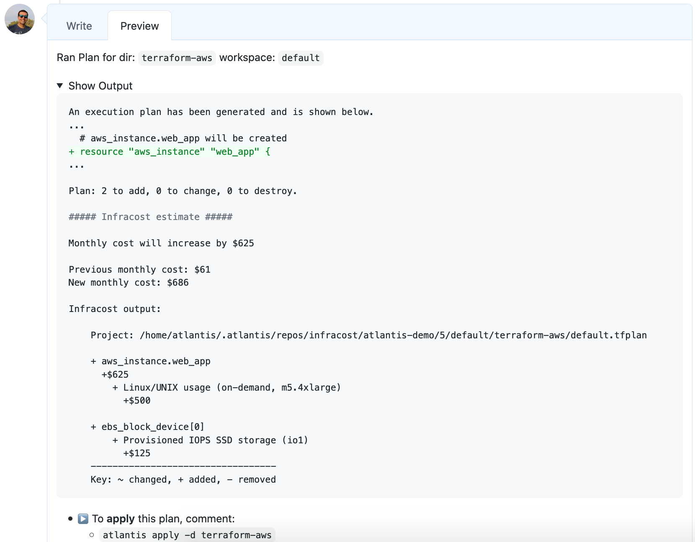

# Append to Atlantis comment

This Atlantis repo.yaml file shows how Infracost can be used with Atlantis. The Infracost cost estimate is appended to the bottom of the Atlantis output in each Atlantis pull request comment.



1. Update your setup to use the [infracost-atlantis](https://hub.docker.com/r/infracost/infracost-atlantis) Docker image

2. If you haven't done so already, [download Infracost](https://www.infracost.io/docs/#quick-start) and run `infracost auth login` to get a free API key.

3. Retrieve your Infracost API key by running `infracost configure get api_key`.

4. You'll need to pass the following custom env var into the container.

   ```sh
   INFRACOST_API_KEY=<your-infracost-api-token>
   ```

5. Add the following yaml spec to `repos.yaml` or `atlantis.yaml` config files:

    ```yaml
    repos:
      - id: /.*/
        workflow: terraform-infracost
    workflows:
      terraform-infracost:
        plan:
          steps:
            - init
            - plan
            - show # this writes the plan JSON to $SHOWFILE
            - env:
                name: INFRACOST_OUTPUT
                command: 'echo "/tmp/$BASE_REPO_OWNER-$BASE_REPO_NAME-$PULL_NUM-$WORKSPACE-${REPO_REL_DIR//\//-}-infracost.json"'
            # This instructs the CLI to send cost estimates to Infracost Cloud. Our SaaS product
            #   complements the open source CLI by giving teams advanced visibility and controls.
            #   The cost estimates are transmitted in JSON format and do not contain any cloud
            #   credentials or secrets (see https://infracost.io/docs/faq/ for more information).
            - env:
                name: INFRACOST_ENABLE_CLOUD
                value: true
            # Run Infracost breakdown and save to a tempfile, namespaced by this project, PR, workspace and dir
            - run: |
                infracost breakdown --path=$SHOWFILE \
                                    --format=json \
                                    --log-level=info \
                                    --out-file=$INFRACOST_OUTPUT \
                                    --project-name=$REPO_REL_DIR
            - run: |
                # Read the breakdown JSON and get costs using jq.
                # Note jq comes as standard as part of infracost-atlantis Docker images. If you are using the base atlantis
                # image you'll need to manually install jq. e.g:
                # curl https://stedolan.github.io/jq/download/linux64/jq > /usr/local/bin/jq; chmod +x /usr/local/bin/jq
                past_total_monthly_cost=$(cat $INFRACOST_OUTPUT | jq -r "(.pastTotalMonthlyCost // 0) | tonumber")
                total_monthly_cost=$(cat $INFRACOST_OUTPUT | jq -r "(.totalMonthlyCost // 0) | tonumber")
                diff_total_monthly_cost=$(cat $INFRACOST_OUTPUT | jq -r "(.diffTotalMonthlyCost // 0) | tonumber")

                currency=$(cat $INFRACOST_OUTPUT | jq -r '.currency | select (.!=null)')
                if [ "$currency" = "" ] || [ "$currency" = "USD" ]; then
                  currency="$"
                elif [ "$currency" = "EUR" ]; then
                  currency="€"
                elif [ "$currency" = "GBP" ]; then
                  currency="£"
                else
                  currency="$currency " # Space is needed so output is "INR 123"
                fi

                # Run infracost output to get the diff output
                diff_output=$(infracost output --no-color --format diff --show-skipped --path=$INFRACOST_OUTPUT)

                change_symbol () {
                  local old=$1
                  local new=$2

                  local change_symbol="+"
                  if [ "$(echo "$new < $old" | bc -l)" = 1 ]; then
                    change_symbol=""
                  fi

                  printf "%s" "$change_symbol"
                }

                percent_display () {
                  local old=$1
                  local new=$2

                  local percent
                  local sym

                  percent=$(calculate_percentage "$old" "$new")
                  sym=$(change_symbol "$old" "$new")

                  local s=""
                  if [ -n "$percent" ]; then
                    s="$(printf "%.0f" "$percent")"
                    s=" ($sym$s%%)"
                  fi

                  printf "%s" "$s"
                }

                calculate_percentage () {
                  local old=$1
                  local new=$2

                  local percent=""

                  # If both old and new costs are greater than 0
                  if [ "$(echo "$old > 0" | bc -l)" = 1 ] && [ "$(echo "$new > 0" | bc -l)" = 1 ]; then
                    percent="$(echo "scale=6; $new / $old * 100 - 100" | bc)"
                  fi

                  # If both old and new costs are less than or equal to 0
                  if [ "$(echo "$old <= 0" | bc -l)" = 1 ] && [ "$(echo "$new <= 0" | bc -l)" = 1 ]; then
                    percent="0"
                  fi

                  printf "%s" "$percent"
                }

                format_cost () {
                  cost=$1

                  if [ -z "$cost" ] || [ "$cost" = "null" ]; then
                    echo "-"
                  elif [ "$(echo "$cost < 100" | bc -l)" = 1 ]; then
                    printf "$currency%0.2f" "$cost"
                  else
                    printf "$currency%0.0f" "$cost"
                  fi
                }

                percent=$(percent_display "$past_total_monthly_cost" "$total_monthly_cost" | sed "s/%/%%/g")

                change_word="increase"
                if [ "$(echo "$past_total_monthly_cost > $total_monthly_cost" | bc -l)" = 1 ]; then
                  change_word="decrease"
                fi

                msg="##### Infracost estimate #####"
                msg="${msg}\n\n"
                msg="${msg}Monthly cost will $change_word by $(format_cost $diff_total_monthly_cost)$percent\n"
                msg="${msg}\n"
                msg="${msg}Previous monthly cost: $(format_cost $past_total_monthly_cost)\n"
                msg="${msg}New monthly cost: $(format_cost $total_monthly_cost)\n"
                msg="${msg}\n"
                msg="${msg}Infracost output:\n"
                msg="${msg}\n"
                msg="${msg}$(echo "$diff_output" | sed 's/^/    /' | sed "s/%/%%/g")\n"

                printf "$msg"
    ```

6. Restart the Atlantis application with the new environment vars and config
7. Send a pull request to change something in the Terraform code, the Infracost output should be added to your Atlantis comment.

   
8. To see the test pull request costs in Infracost Cloud, [log in](https://dashboard.infracost.io/) > switch to your organization > Projects. To learn more, see [our docs](https://www.infracost.io/docs/infracost_cloud/get_started/).

    
9. Follow [the docs](https://www.infracost.io/usage-file) if you'd also like to show cost for of usage-based resources such as AWS Lambda or S3. The usage for these resources are fetched from CloudWatch/cloud APIs and used to calculate an estimate.
