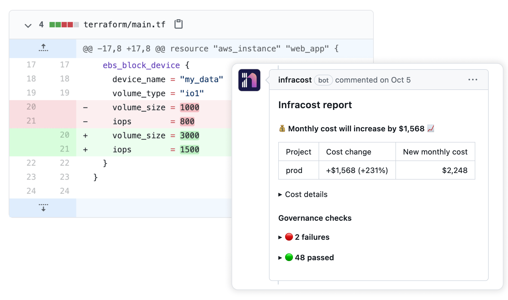

# Combined Infracost comment

| Note: This examples requires Atlantis versions 0.18.2 or later due to the use of post_workflow_hooks |
| --- |

This Atlantis repo.yaml file shows how Infracost can be used with Atlantis. Even when a repository that contains multiple terraform directories or workspaces is used, this example uses `infracost comment` to post a combined cost estimate comment for all modified projects.



## Table of Contents

* [Running with GitHub](#running-with-github)
* [Running with GitLab](#running-with-gitlab)
* [Running with Azure Repos](#running-with-azure-repos)
* [Running with Bitbucket](#running-with-bitbucket)

## Running with GitHub

1. Update your setup to use the [infracost-atlantis](https://hub.docker.com/r/infracost/infracost-atlantis) Docker image
2. If you haven't done so already, [download Infracost](https://www.infracost.io/docs/#quick-start) and run `infracost auth login` to get a free API key.
3. Retrieve your Infracost API key by running `infracost configure get api_key`.
4. You'll need to pass the following custom env var into the container.

  ```sh
  GITHUB_TOKEN=<your-github-token>
  INFRACOST_API_KEY=<your-infracost-api-token>
  ```

5. Add the following yaml spec to `repos.yaml` or `atlantis.yaml` config files:

  ```yaml
  repos:
    - id: /.*/
      workflow: terraform-infracost
      post_workflow_hooks:
        # This instructs the CLI to send cost estimates to Infracost Cloud. Our SaaS product
        #   complements the open source CLI by giving teams advanced visibility and controls.
        #   The cost estimates are transmitted in JSON format and do not contain any cloud
        #   credentials or secrets (see https://infracost.io/docs/faq/ for more information).
        - env:
            name: INFRACOST_ENABLE_CLOUD
            value: true
        - run: |
            # post_workflow_hooks are executed after the repo workflow has run.
            # This enables you to post an Infracost comment with the combined cost output
            # from all your projects. However, post_workflow_hooks are also triggered when
            # an apply occurs. In order to stop commenting on PRs twice we need to check
            # if the Infracost output directory created in our 'plan' stage exists before continuing.
            if [ ! -d "/tmp/$BASE_REPO_OWNER-$BASE_REPO_NAME-$PULL_NUM" ]; then
              exit 0
            fi

            # Choose the commenting behavior, 'new' is a good default:
            # new: Create a new cost estimate comment on every run of Atlantis for each project.
            # update: Create a single comment and update it. The "quietest" option.
            # hide-and-new: Minimize previous comments and create a new one.
            # delete-and-new: Delete previous comments and create a new one.
            infracost comment github --repo $BASE_REPO_OWNER/$BASE_REPO_NAME \
                                     --pull-request $PULL_NUM \
                                     --path /tmp/$BASE_REPO_OWNER-$BASE_REPO_NAME-$PULL_NUM/'*'-infracost.json \
                                     --github-token $GITHUB_TOKEN \
                                     --behavior new

            # remove the Infracost output directory so that `infracost comment` is not
            # triggered on an `atlantis apply`
            rm -rf /tmp/$BASE_REPO_OWNER-$BASE_REPO_NAME-$PULL_NUM
  workflows:
    terraform-infracost:
      plan:
        steps:
          - env:
              name: INFRACOST_OUTPUT
              command: 'echo "/tmp/$BASE_REPO_OWNER-$BASE_REPO_NAME-$PULL_NUM/$WORKSPACE-${REPO_REL_DIR//\//-}-infracost.json"'
          # This instructs the CLI to send cost estimates to Infracost Cloud. Our SaaS product
          #   complements the open source CLI by giving teams advanced visibility and controls.
          #   The cost estimates are transmitted in JSON format and do not contain any cloud
          #   credentials or secrets (see https://infracost.io/docs/faq/ for more information).
          - env:
              name: INFRACOST_ENABLE_CLOUD
              value: true
          - init
          - plan
          - show # this writes the plan JSON to $SHOWFILE
          # Run Infracost breakdown and save to a tempfile, namespaced by this project, PR, workspace and dir
          - run: |
              if [ ! -d "/tmp/$BASE_REPO_OWNER-$BASE_REPO_NAME-$PULL_NUM" ]; then
                mkdir -p /tmp/$BASE_REPO_OWNER-$BASE_REPO_NAME-$PULL_NUM
              fi

              infracost breakdown --path=$SHOWFILE \
                                  --format=json \
                                  --log-level=info \
                                  --out-file=$INFRACOST_OUTPUT \
                                  --project-name=$REPO_REL_DIR
  ```

6. Restart the Atlantis application with the new environment vars and config.
7. Send a pull request in GitHub to change something in the Terraform code, the Infracost pull request comment should be added and show details for every changed project.

   
8. To see the test pull request costs in Infracost Cloud, [log in](https://dashboard.infracost.io/) > switch to your organization > Projects. To learn more, see [our docs](https://www.infracost.io/docs/infracost_cloud/get_started/).

    
9. Follow [the docs](https://www.infracost.io/usage-file) if you'd also like to show cost for of usage-based resources such as AWS Lambda or S3. The usage for these resources are fetched from CloudWatch/cloud APIs and used to calculate an estimate.

## Running with GitLab

1. Update your setup to use the [infracost-atlantis](https://hub.docker.com/r/infracost/infracost-atlantis) Docker image
2. If you haven't done so already, [download Infracost](https://www.infracost.io/docs/#quick-start) and run `infracost auth login` to get a free API key.
3. Retrieve your Infracost API key by running `infracost configure get api_key`.
4. You'll need to pass the following custom env var into the container.

  ```sh
  GITLAB_TOKEN=<your-gitlab-token>
  INFRACOST_API_KEY=<your-infracost-api-token>
  ```

5. Add the following yaml spec to `repos.yaml` config files:

  ```yaml
  repos:
    - id: /.*/
      workflow: terraform-infracost
      pre_workflow_hooks:
        # Clean up any files left over from previous runs
        - run: rm -rf /tmp/$BASE_REPO_OWNER-$BASE_REPO_NAME-$PULL_NUM
        - run: mkdir -p /tmp/$BASE_REPO_OWNER-$BASE_REPO_NAME-$PULL_NUM
      post_workflow_hooks:
        # This instructs the CLI to send cost estimates to Infracost Cloud. Our SaaS product
        #   complements the open source CLI by giving teams advanced visibility and controls.
        #   The cost estimates are transmitted in JSON format and do not contain any cloud
        #   credentials or secrets (see https://infracost.io/docs/faq/ for more information).
        - env:
            name: INFRACOST_ENABLE_CLOUD
            value: true
        - run: |
            # Choose the commenting behavior, 'new' is a good default:
            # new: Create a new cost estimate comment on every run of Atlantis for each project.
            # update: Create a single comment and update it. The "quietest" option.
            # delete-and-new: Delete previous comments and create a new one.
            infracost comment gitlab --repo $BASE_REPO_OWNER/$BASE_REPO_NAME \
                                     --merge-request $PULL_NUM \
                                     --path /tmp/$BASE_REPO_OWNER-$BASE_REPO_NAME-$PULL_NUM/'*'-infracost.json \
                                     --gitlab-token $GITLAB_TOKEN \
                                     --behavior new
        - run: rm -rf /tmp/$BASE_REPO_OWNER-$BASE_REPO_NAME-$PULL_NUM
  workflows:
    terraform-infracost:
      plan:
        steps:
          - env:
              name: INFRACOST_OUTPUT
              command: 'echo "/tmp/$BASE_REPO_OWNER-$BASE_REPO_NAME-$PULL_NUM/$WORKSPACE-${REPO_REL_DIR//\//-}-infracost.json"'
          - init
          - plan
          - show # this writes the plan JSON to $SHOWFILE
          # Run Infracost breakdown and save to a tempfile, namespaced by this project, PR, workspace and dir
          - run: infracost breakdown --path=$SHOWFILE --format=json --log-level=info --out-file=$INFRACOST_OUTPUT --project-name=$REPO_REL_DIR
  ```

6. Restart the Atlantis application with the new environment vars and config.
7. Send a merge request in GitLab to change something in the Terraform code, the Infracost merge request comment should be added and show details for every changed project.

   
8. To see the test pull request costs in Infracost Cloud, [log in](https://dashboard.infracost.io/) > switch to your organization > Projects. To learn more, see [our docs](https://www.infracost.io/docs/infracost_cloud/get_started/).

    
9. Follow [the docs](https://www.infracost.io/usage-file) if you'd also like to show cost for of usage-based resources such as AWS Lambda or S3. The usage for these resources are fetched from CloudWatch/cloud APIs and used to calculate an estimate.

## Running with Azure Repos

1. Update your setup to use the [infracost-atlantis](https://hub.docker.com/r/infracost/infracost-atlantis) Docker image
2. If you haven't done so already, [download Infracost](https://www.infracost.io/docs/#quick-start) and run `infracost auth login` to get a free API key.
3. Retrieve your Infracost API key by running `infracost configure get api_key`.
4. You'll need to pass the following custom env vars into the container. Retrieve your Infracost API key by running `infracost configure get api_key`. We recommend using your same API key in all environments. If you don't have one, [download Infracost](https://www.infracost.io/docs/#quick-start) and run `infracost auth login` to get a free API key.

  ```sh
  AZURE_ACCESS_TOKEN=<your-azure-devops-access-token-or-pat>
  AZURE_REPO_URL=<your-azure-repo-url> # i.e., https://dev.azure.com/your-org/your-project/_git/your-repo
  INFRACOST_API_KEY=<your-infracost-api-token>
  ```

3. Add the following yaml spec to `repos.yaml` config files:

  ```yaml
  repos:
    - id: /.*/
      workflow: terraform-infracost
      pre_workflow_hooks:
        # Clean up any files left over from previous runs
        - run: rm -rf /tmp/${BASE_REPO_OWNER//\//-}-$BASE_REPO_NAME-$PULL_NUM
        - run: mkdir -p /tmp/${BASE_REPO_OWNER//\//-}-$BASE_REPO_NAME-$PULL_NUM
      post_workflow_hooks:
        # This instructs the CLI to send cost estimates to Infracost Cloud. Our SaaS product
        #   complements the open source CLI by giving teams advanced visibility and controls.
        #   The cost estimates are transmitted in JSON format and do not contain any cloud
        #   credentials or secrets (see https://infracost.io/docs/faq/ for more information).
        - env:
            name: INFRACOST_ENABLE_CLOUD
            value: true
        - run: |
            # Choose the commenting behavior, 'new' is a good default:
            # new: Create a new cost estimate comment on every run of Atlantis for each project.
            # update: Create a single comment and update it. The "quietest" option.
            # delete-and-new: Delete previous comments and create a new one.
            infracost comment azure-repos --repo-url $AZURE_REPO_URL \
                                          --pull-request $PULL_NUM \
                                          --path /tmp/${BASE_REPO_OWNER//\//-}-$BASE_REPO_NAME-$PULL_NUM/'*'-infracost.json \
                                          --azure-access-token $AZURE_ACCESS_TOKEN \
                                          --tag $INFRACOST_COMMENT_TAG \
                                          --behavior new
        - run: rm -rf /tmp/${BASE_REPO_OWNER//\//-}-$BASE_REPO_NAME-$PULL_NUM
  workflows:
    terraform-infracost:
      plan:
        steps:
          - env:
              name: INFRACOST_OUTPUT
              command: 'echo "/tmp/${BASE_REPO_OWNER//\//-}-$BASE_REPO_NAME-$PULL_NUM/$WORKSPACE-${REPO_REL_DIR//\//-}-infracost.json"'
          - init
          - plan
          - show # this writes the plan JSON to $SHOWFILE
          # Run Infracost breakdown and save to a tempfile, namespaced by this project, PR, workspace and dir
          - run: infracost breakdown --path=$SHOWFILE --format=json --log-level=info --out-file=$INFRACOST_OUTPUT --project-name=$REPO_REL_DIR
  ```

6. Restart the Atlantis application with the new environment vars and config.
7. Send a pull request in Azure Repos to change something in the Terraform code, the Infracost merge request comment should be added and show details for every changed project.

   
8. To see the test pull request costs in Infracost Cloud, [log in](https://dashboard.infracost.io/) > switch to your organization > Projects. To learn more, see [our docs](https://www.infracost.io/docs/infracost_cloud/get_started/).

    
9. Follow [the docs](https://www.infracost.io/usage-file) if you'd also like to show cost for of usage-based resources such as AWS Lambda or S3. The usage for these resources are fetched from CloudWatch/cloud APIs and used to calculate an estimate.

## Running with Bitbucket

1. Update your setup to use the [infracost-atlantis](https://hub.docker.com/r/infracost/infracost-atlantis) Docker image
2. If you haven't done so already, [download Infracost](https://www.infracost.io/docs/#quick-start) and run `infracost auth login` to get a free API key.
3. Retrieve your Infracost API key by running `infracost configure get api_key`.
4. You'll need to pass the following custom env vars into the container. Retrieve your Infracost API key by running `infracost configure get api_key`. We recommend using your same API key in all environments. If you don't have one, [download Infracost](https://www.infracost.io/docs/#quick-start) and run `infracost auth login` to get a free API key.

  ```sh
  BITBUCKET_TOKEN=<your-bitbucket-token> # for Bitbucket Cloud this should be username:token, where the token can be a user or App password. For Bitbucket Server provide only an HTTP access token.
  INFRACOST_API_KEY=<your-infracost-api-token>
  ```

5. Add the following yaml spec to `repos.yaml` config files:

  ```yaml
  repos:
    - id: /.*/
      workflow: terraform-infracost
      pre_workflow_hooks:
        # Clean up any files left over from previous runs
        - run: rm -rf /tmp/$BASE_REPO_OWNER-$BASE_REPO_NAME-$PULL_NUM
        - run: mkdir -p /tmp/$BASE_REPO_OWNER-$BASE_REPO_NAME-$PULL_NUM
      post_workflow_hooks:
        # This instructs the CLI to send cost estimates to Infracost Cloud. Our SaaS product
        #   complements the open source CLI by giving teams advanced visibility and controls.
        #   The cost estimates are transmitted in JSON format and do not contain any cloud
        #   credentials or secrets (see https://infracost.io/docs/faq/ for more information).
        - env:
            name: INFRACOST_ENABLE_CLOUD
            value: true
        - run: |
            # post_workflow_hooks are executed after the repo workflow has run.
            # This enables you to post an Infracost comment with the combined cost output
            # from all your projects. However, post_workflow_hooks are also triggered when
            # an apply occurs. In order to stop commenting on PRs twice we need to check
            # if the Infracost output directory created in our 'plan' stage exists before continuing.
            if [ ! -d "/tmp/$BASE_REPO_OWNER-$BASE_REPO_NAME-$PULL_NUM" ]; then
              exit 0
            fi

            # Choose the commenting behavior, 'new' is a good default:
            # new: Create a new cost estimate comment on every run of Atlantis for each project.
            # update: Create a single comment and update it. The "quietest" option.
            # hide-and-new: Minimize previous comments and create a new one.
            # delete-and-new: Delete previous comments and create a new one.
            infracost comment bitbucket --repo $BASE_REPO_OWNER/$BASE_REPO_NAME \
                                        --pull-request $PULL_NUM \
                                        --path /tmp/$BASE_REPO_OWNER-$BASE_REPO_NAME-$PULL_NUM/'*'-infracost.json \
                                        --bitbucket-token $BITBUCKET_TOKEN \
                                        --behavior new

            # remove the Infracost output directory so that `infracost comment` is not
            # triggered on an `atlantis apply`
        - run: rm -rf /tmp/$BASE_REPO_OWNER-$BASE_REPO_NAME-$PULL_NUM
  workflows:
    terraform-infracost:
      plan:
        steps:
          - env:
              name: INFRACOST_OUTPUT
              command: 'echo "/tmp/$BASE_REPO_OWNER-$BASE_REPO_NAME-$PULL_NUM/$WORKSPACE-${REPO_REL_DIR//\//-}-infracost.json"'
          - init
          - plan
          - show # this writes the plan JSON to $SHOWFILE
          # Run Infracost breakdown and save to a tempfile, namespaced by this project, PR, workspace and dir
          - run: |
              if [ ! -d "/tmp/$BASE_REPO_OWNER-$BASE_REPO_NAME-$PULL_NUM" ]; then
                mkdir -p /tmp/$BASE_REPO_OWNER-$BASE_REPO_NAME-$PULL_NUM
              fi

              infracost breakdown --path=$SHOWFILE \
                                  --format=json \
                                  --log-level=info \
                                  --out-file=$INFRACOST_OUTPUT \
                                  --project-name=$REPO_REL_DIR
  ```

6. Restart the Atlantis application with the new environment vars and config.
7. Send a pull request in Bitbucket to change something in the Terraform code, the Infracost pull request comment should be added and show details for every changed project.

   
8. To see the test pull request costs in Infracost Cloud, [log in](https://dashboard.infracost.io/) > switch to your organization > Projects. To learn more, see [our docs](https://www.infracost.io/docs/infracost_cloud/get_started/).

    
9. Follow [the docs](https://www.infracost.io/usage-file) if you'd also like to show cost for of usage-based resources such as AWS Lambda or S3. The usage for these resources are fetched from CloudWatch/cloud APIs and used to calculate an estimate.
