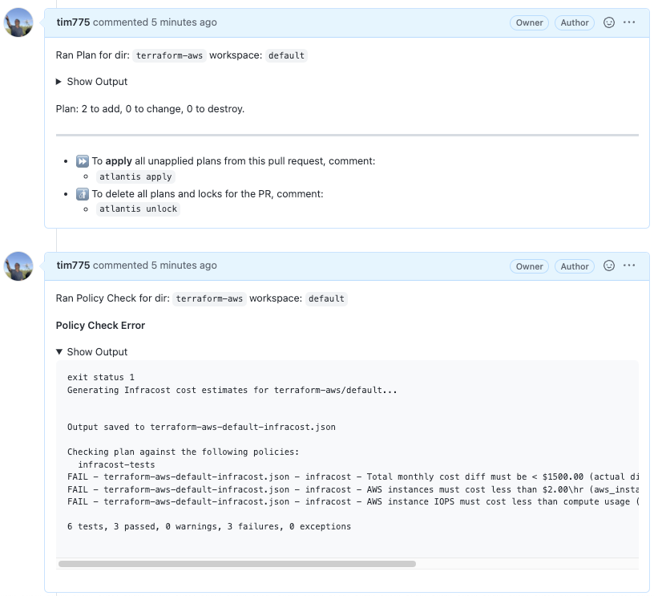
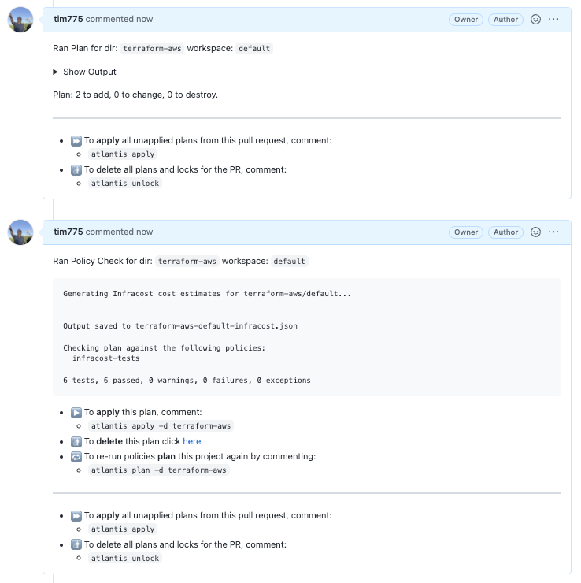

# Conftest Example

This example shows how to use [Atlantis' built in Conftest](https://www.runatlantis.io/docs/policy-checking.html) support with Infracost to enforce cost policies.

## Configuration

1. Add the yaml contents of this file to your `repos.yaml` or `atlantis.yaml` server side config file:
   ```yaml
   repos:
     - id: /.*/
     workflow: terraform-infracost
   workflows:
     terraform-infracost:
       policy_check:
         steps:
           - env:
               name: INFRACOST_JSON
               command: 'echo $REPO_REL_DIR-$WORKSPACE-infracost.json'
           - show
           - run: echo "Generating Infracost cost estimates for $REPO_REL_DIR/$WORKSPACE..."
           - run: infracost breakdown --path=$SHOWFILE --format=json --out-file=$INFRACOST_JSON --log-level=warn --no-color
           - policy_check:
               extra_args: [ "-p /home/atlantis/policy", "--namespace", "infracost", "$INFRACOST_JSON" ]
           - run: rm -rf $INFRACOST_JSON
   policies:
     owners:
       users:
         - example-dev
     policy_sets:
       - name: infracost-tests
         path: /home/atlantis/policy
         source: local
   ```
2. Add create a policy file in the [Rego language](https://www.openpolicyagent.org/docs/latest/policy-language/) `policy.rego` and make it available at `/home/atlantis/policy`:
   ```rego
   package infracost

   deny_totalDiff[msg] {
   maxDiff = 1500.0
   to_number(input.diffTotalMonthlyCost) >= maxDiff

            msg := sprintf(
                "Total monthly cost diff must be < $%.2f (actual diff is $%v)",
                [maxDiff, to_number(input.diffTotalMonthlyCost)],
            )
   }

   deny_instanceCost[msg] {
   r := input.projects[_].breakdown.resources[_]
   startswith(r.name, "aws_instance.")

            maxHourlyCost := 2.0
            to_number(r.hourlyCost) > maxHourlyCost

            msg := sprintf(
                "AWS instances must cost less than $%.2f\\hr (%s costs $%v\\hr).",
                [maxHourlyCost, r.name, to_number(r.hourlyCost)],
            )
   }

   deny_instanceCost[msg] {
   r := input.projects[_].breakdown.resources[_]
   startswith(r.name, "aws_instance.")

            baseHourlyCost := to_number(r.costComponents[_].hourlyCost)

            sr_cc := r.subresources[_].costComponents[_]
            sr_cc.name == "Provisioned IOPS"
            iopsHourlyCost := to_number(sr_cc.hourlyCost)

            iopsHourlyCost > baseHourlyCost

            msg := sprintf(
                "AWS instance IOPS must cost less than compute usage (%s IOPS $%v\\hr, usage $%v\\hr).",
                [r.name, iopsHourlyCost, baseHourlyCost],
            )
   }
   ```
3. On the Atlantis server, export env vars for:
   export INFRACOST_API_KEY=<your-infracost-api-token>
4. Run the `infracost/infracost-atlantis` image, which includes the Infracost CLI in addition to Atlantis:
   ```
   docker run -p 4141:4141 -e INFRACOST_API_KEY=$INFRACOST_API_KEY \
     --mount type=bind,source=$(pwd)/examples/conftest/conftest.yml,target=/home/atlantis/repo.yml \
     --mount type=bind,source=$(pwd)/examples/conftest/policy,target=/home/atlantis/policy \
     infracost/infracost-atlantis:latest \
     --gh-user=<your-github-user> \
     --gh-token=$GITHUB_TOKEN \
     --gh-webhook-secret=<your-github-webhook-secret> \
     --repo-allowlist='github.com/your-org/*' \
     --repo-config=/home/atlantis/repo.yml \
     --enable-policy-checks
   ```
5. Send a pull request in GitHub to change something in Terraform, note the policy checks are performed.
6. Experiment with different cost policies by editing the policy file generated in the pre_workflow_hook.

## Usage

After a plan is created, Atlantis will run Infracost to generate cost estimates which evaluated againt the policy
with Conftest.  If the plan does not pass the policy, Atlantis will not allow it to be applied until it fixed to 
be in compliance, or approved by an authorized user: 



When the policy check passes, the plan can be applied as usual:



See the [Atlantis documentation](https://www.runatlantis.io/docs/policy-checking.html#how-it-works)
for more information.
