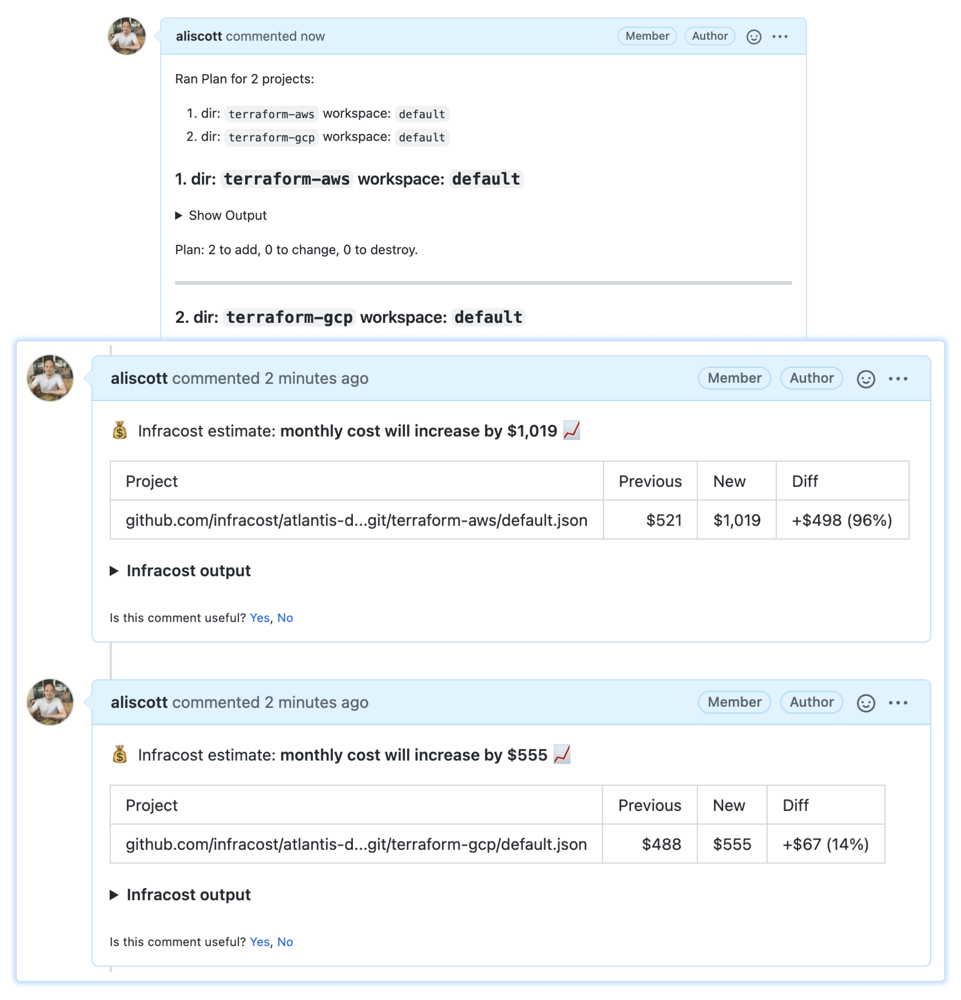

# Multiple Infracost comments

This Atlantis repo.yaml file shows how Infracost can be used with Atlantis. When a repository that contains multiple terraform directories/workspaces is used, this example uses `infracost comment` to post one cost estimate comment per modified projects/workspace.



## Table of Contents

* [Running with GitHub](#running-with-github)
* [Running with GitLab](#running-with-gitlab)
* [Running with Azure Repos](#running-with-azure-repos)

For Bitbucket, see [our docs](https://www.infracost.io/docs/features/cli_commands/#bitbucket) for how to post comments using `infracost comment bitbucket`.

## Running with GitHub

1. Update your setup to use the [infracost-atlantis](https://hub.docker.com/r/infracost/infracost-atlantis) Docker image.
2. You'll need to pass the following custom env vars into the container. Retrieve your Infracost API key by running `infracost configure get api_key`. We recommend using your same API key in all environments. If you don't have one, [download Infracost](https://www.infracost.io/docs/#quick-start) and run `infracost register` to get a free API key.
  ```sh
  GITHUB_TOKEN=<your-github-token>
  INFRACOST_API_KEY=<your-infracost-api-token>
  ```
3. Add the following YAML spec to `repos.yaml` or `atlantis.yaml` config files:
  ```yaml
  repos:
    - id: /.*/
      workflow: terraform-infracost
  workflows:
    terraform-infracost:
      plan:
        steps:
          - env:
              name: INFRACOST_OUTPUT
              command: 'echo "/tmp/$BASE_REPO_OWNER-$BASE_REPO_NAME-$PULL_NUM-$WORKSPACE-$REPO_REL_DIR-infracost.json"'
          - env:
              name: INFRACOST_COMMENT_TAG
              command: 'echo "$BASE_REPO_OWNER-$BASE_REPO_NAME-$PULL_NUM-$WORKSPACE-$REPO_REL_DIR"'
          - init
          - plan
          - show # this writes the plan JSON to $SHOWFILE
          # Run Infracost breakdown and save to a tempfile, namespaced by this project, PR, workspace and dir
          - run: |
              infracost breakdown --path=$SHOWFILE \
                                  --format=json \
                                  --log-level=info \
                                  --out-file=$INFRACOST_OUTPUT
          - run: |
              # Choose the commenting behavior, 'new' is a good default:
              #   new: Create a new cost estimate comment on every run of Atlantis for each project.
              #   update: Create a single comment and update it. The "quietest" option.
              #   hide-and-new: Minimize previous comments and create a new one.
              #   delete-and-new: Delete previous comments and create a new one.
              # You can use `tag` to customize the hidden markdown tag used to detect comments posted by Infracost. We pass in the project directory here
              # so that there are no conflicts across projects when posting to the pull request. This is especially important if you
              # use a comment behavior other than "new".
              infracost comment github --repo $BASE_REPO_OWNER/$BASE_REPO_NAME \
                                      --pull-request $PULL_NUM \
                                      --path $INFRACOST_OUTPUT \
                                      --github-token $GITHUB_TOKEN \
                                      --tag $INFRACOST_COMMENT_TAG \
                                      --behavior new
  ```
4. Restart the Atlantis application with the new environment vars and config.
5. Send a pull request in GitHub to change something in the Terraform code, the Infracost pull request comment should be added.

## Running with GitLab

1. Update your setup to use the [infracost-atlantis](https://hub.docker.com/r/infracost/infracost-atlantis) Docker image.
2. You'll need to pass the following custom env vars into the container. Retrieve your Infracost API key by running `infracost configure get api_key`. We recommend using your same API key in all environments. If you don't have one, [download Infracost](https://www.infracost.io/docs/#quick-start) and run `infracost register` to get a free API key.
  ```sh
  GITLAB_TOKEN=<your-gitlab-token>
  INFRACOST_API_KEY=<your-infracost-api-token>
  ```
3. Add the following YAML spec to `repos.yaml` or `atlantis.yaml` config files:
  ```yaml
  repos:
    - id: /.*/
      workflow: terraform-infracost
  workflows:
    terraform-infracost:
      plan:
        steps:
          - env:
              name: INFRACOST_OUTPUT
              command: 'echo "/tmp/$BASE_REPO_OWNER-$BASE_REPO_NAME-$PULL_NUM-$WORKSPACE-$REPO_REL_DIR-infracost.json"'
          - env:
              name: INFRACOST_COMMENT_TAG
              command: 'echo "$BASE_REPO_OWNER-$BASE_REPO_NAME-$PULL_NUM-$WORKSPACE-$REPO_REL_DIR"'
          - init
          - plan
          - show # this writes the plan JSON to $SHOWFILE
          # Run Infracost breakdown and save to a tempfile, namespaced by this project, PR, workspace and dir
          - run: |
              infracost breakdown --path=$SHOWFILE \
                                  --format=json \
                                  --log-level=info \
                                  --out-file=$INFRACOST_OUTPUT
          - run: |
              # Choose the commenting behavior, 'new' is a good default:
              #   new: Create a new cost estimate comment on every run of Atlantis for each project.
              #   update: Create a single comment and update it. The "quietest" option.
              #   delete-and-new: Delete previous comments and create a new one.
              # You can use `tag` to customize the hidden markdown tag used to detect comments posted by Infracost. We pass in the project directory here
              # so that there are no conflicts across projects when posting to the pull request. This is especially important if you
              # use a comment behavior other than "new".
              infracost comment gitlab --repo $BASE_REPO_OWNER/$BASE_REPO_NAME \
                                      --merge-request $PULL_NUM \
                                      --path $INFRACOST_OUTPUT \
                                      --gitlab-token $GITLAB_TOKEN \
                                      --tag $INFRACOST_COMMENT_TAG \
                                      --behavior new
  ```
4. Restart the Atlantis application with the new environment vars and config.
5. Send a merge request in GitLab to change something in the Terraform code, the Infracost merge request comment should be added.

## Running with Azure Repos

1. Update your setup to use the [infracost-atlantis](https://hub.docker.com/r/infracost/infracost-atlantis) Docker image.
2. You'll need to pass the following custom env vars into the container. Retrieve your Infracost API key by running `infracost configure get api_key`. We recommend using your same API key in all environments. If you don't have one, [download Infracost](https://www.infracost.io/docs/#quick-start) and run `infracost register` to get a free API key.
  ```sh
  AZURE_ACCESS_TOKEN=<your-azure-devops-access-token-or-pat>
  AZURE_REPO_URL=<your-azure-repo-url> # i.e., https://dev.azure.com/your-org/your-project/_git/your-repo
  INFRACOST_API_KEY=<your-infracost-api-token>
  ```
3. Add the following YAML spec to `repos.yaml` or `atlantis.yaml` config files:
  ```yaml
  repos:
    - id: /.*/
      workflow: terraform-infracost
  workflows:
    terraform-infracost:
      plan:
        steps:
          - env:
              name: INFRACOST_OUTPUT
              command: 'echo "/tmp/${BASE_REPO_OWNER//\//-}-$BASE_REPO_NAME-$PULL_NUM-$WORKSPACE-$REPO_REL_DIR-infracost.json"'
          - env:
              name: INFRACOST_COMMENT_TAG
              command: 'echo "${BASE_REPO_OWNER//\//-}-$BASE_REPO_NAME-$PULL_NUM-$WORKSPACE-$REPO_REL_DIR"'
          - init
          - plan
          - show # this writes the plan JSON to $SHOWFILE
          # Run Infracost breakdown and save to a tempfile, namespaced by this project, PR, workspace and dir
          - run: |
              infracost breakdown --path=$SHOWFILE \
                                  --format=json \
                                  --log-level=info \
                                  --out-file=$INFRACOST_OUTPUT
          - run: |
            # Choose the commenting behavior, 'new' is a good default:
            #   new: Create a new cost estimate comment on every run of Atlantis for each project.
            #   update: Create a single comment and update it. The "quietest" option.
            #   delete-and-new: Delete previous comments and create a new one.
            # You can use `tag` to customize the hidden markdown tag used to detect comments posted by Infracost. We pass in the project directory here
            # so that there are no conflicts across projects when posting to the pull request. This is especially important if you
            # use a comment behavior other than "new".
              infracost comment azure-repos --repo-url $AZURE_REPO_URL \
                                            --pull-request $PULL_NUM \
                                            --path $INFRACOST_OUTPUT \
                                            --azure-access-token $AZURE_ACCESS_TOKEN \
                                            --tag $INFRACOST_COMMENT_TAG \
                                            --behavior new
  ```
4. Restart the Atlantis application with the new environment vars and config.
5. Send a pull request in Azure Repos to change something in the Terraform code, the Infracost pull request comment should be added.
